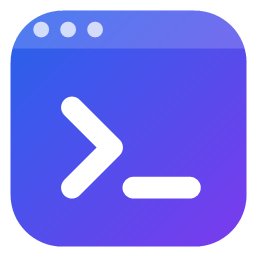
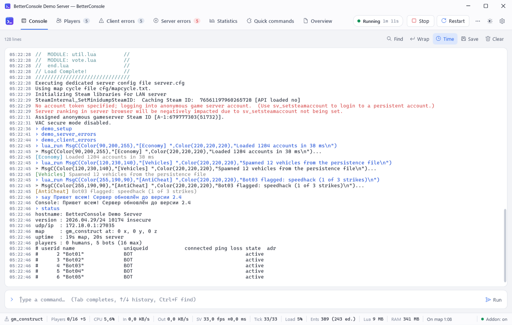
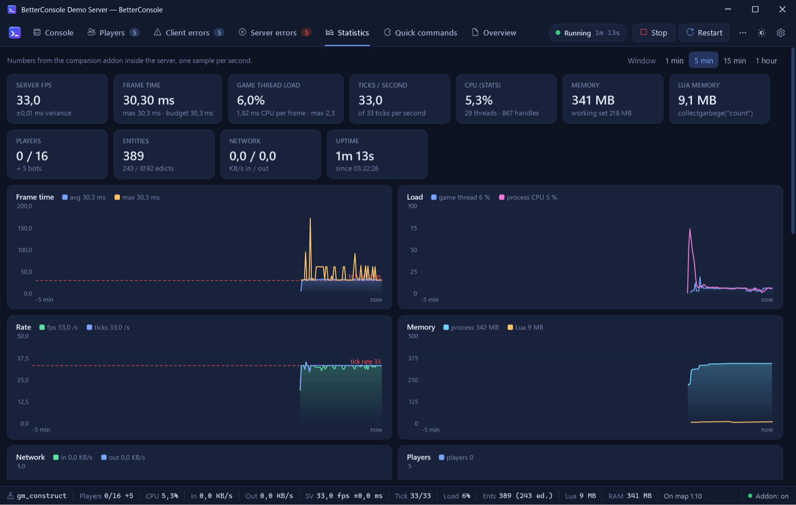
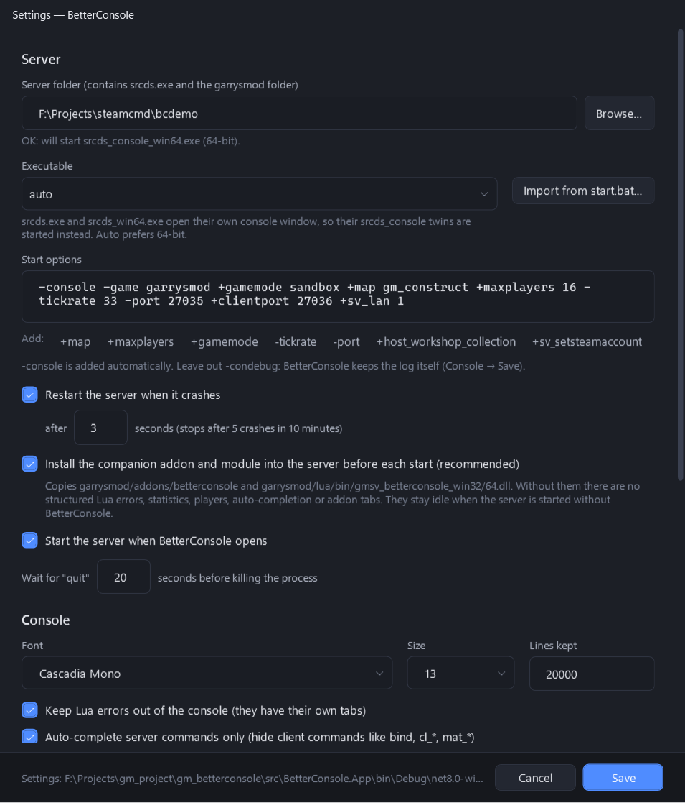
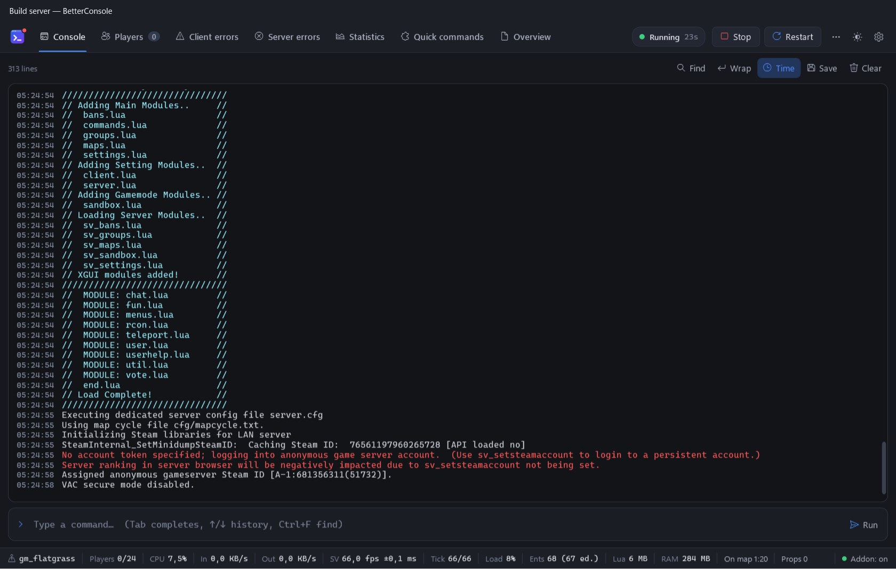

<p align="center">
  
</p>

<h1 align="center">BetterConsole</h1>

<p align="center">
  <b>Современная консоль для выделенного сервера Garry's Mod под Windows</b><br>
  Цвета, автодополнение, Lua-ошибки в отдельных вкладках, игроки, живая статистика и профайлер — и ваши собственные вкладки.
</p>

<p align="center">
  <a href="https://github.com/RainBowSheepx/gm_betterconsole/releases/latest"></a>
  <a href="https://github.com/RainBowSheepx/gm_betterconsole/actions/workflows/ci.yml"></a>
  
  <a href="LICENSE"></a>
</p>

<p align="center"><a href="README.md">Read in English</a></p>


Окно, которое даёт `srcds`, — текстовая консоль из девяностых: почти нет истории, нет поиска,
Lua-ошибки тонут в выводе, кириллица превращается в кракозябры, а о состоянии сервера не сказано
ничего. **BetterConsole** сам запускает ваш сервер и даёт ему настоящую консоль — ничего не меняя в
самом сервере и его аддонах.

## Возможности

- **Консоль, которая ведёт себя по-человечески.** Все цвета `MsgC`, Unicode, поиск (Ctrl+F),
  время у строк, перенос, сохранение в файл. Пролистали вверх — позиция не сбивается, пока идёт
  новый вывод; вернулись в конец (или нажали *Follow*) — консоль снова сама прокручивается. Поле
  ввода живёт в отдельном контейнере, вывод ему не мешает.
- **Автодополнение** всех серверных команд и переменных — с текущим значением и описанием, как в
  консоли игры. Tab подставляет, ↑/↓ выбирают, после `map` / `changelevel` подсказываются карты,
  история команд сохраняется между запусками. Клиентские команды не показываются.
- **Команды просто работают**: текст с кириллицей (`say Привет`) и даже команды, которые Lua
  выполнять отказывается, идут напрямую в движок.
- **Игроки**: таблица со Steam-аватарками и сортировкой (время на сервере — новые снизу, пинг,
  потери, fps, cl_updaterate / cl_cmdrate, сколько процессора сервера стоит каждый игрок, группы по
  старшинству …); столбцы можно скрывать, менять ширину и переставлять. ПКМ по игроку или по
  нескольким выделенным — кик, бан, группа, гаг, мут, тюрьма (совместимо с ULX), с окном для причины
  и срока.
- **Lua-ошибки клиентов** сгруппированы по игрокам, свежие сверху; **ошибки сервера** — старые
  сверху. Одинаковые ошибки не дублируются, а считаются; стрелка показывает стек, текст можно
  выделять, двойной клик по пути к Lua-файлу открывает его на нужной строке в вашем редакторе
  (VS Code, Notepad++ …), и списки не прыгают, пока вы их читаете.
- **Статистика**: FPS сервера и разброс времени кадра, загрузка игрового потока, тикрейт, CPU (так
  же, как считает `stats`), память, память Lua, энтити и эдикты, сеть — графики от минуты до часа;
  **пики лагов** с тем, из чего состоял каждый долгий кадр (самый медленный таймер, сборщик мусора
  Lua, физика; с подробным захватом — ещё самые медленные хуки и net-сообщения и собственный
  профайлер движка); **Lua-профайлер** по
  запросу: хуки, таймеры, net-сообщения, классы энтити. ПКМ в любом месте страницы — скрыть
  ненужное.
- **Статус-бар**: CPU, игроки, in/out, `sv` fps ± разброс, тик, загрузка, энтити, Lua и RAM;
  ПКМ по нему — выбрать, что показывать.
- **Темы**: Dark, Light, Midnight, Graphite — и свои в виде маленького JSON-файла. **Компактный
  режим**: мельче и проще, без теней, анимаций и аватарок, чтобы меньше нагружать процессор и
  графику (на VPS без видеокарты Windows рисует всё программно); всё работает как обычно.
- **Расширяемость**: серверные аддоны несколькими строками Lua добавляют вкладки, числа и графики
  на вкладку «Статистика», пункты в меню игроков (команда или Lua, с диалогом), формы настроек для
  своих консольных переменных, живые таблицы, логи, кнопки и элементы статус-бара, объясняют пики
  лагов, могут подставить свой профайлер и скрывать встроенные части; C#-плагины могут добавить
  что угодно.
- **Несколько серверов в одном приложении** (мультиконсоль): список серверов с состоянием, картой,
  игроками и fps выезжает по клику на логотип, любой сервер можно вынести в отдельное окно.
  Настройки общие.
- **Сам управляет сервером**: старт / стоп / перезапуск, автоперезапуск после падения, режим
  *Always run*, рестарт по расписанию с предупреждением в чате, журнал запусков и остановок с
  причинами, привязка к ядрам CPU и приоритет, импорт вашего `start.bat`.

## Скриншоты

| | |
|---|---|
|  <br> **Автодополнение** с текущими значениями |  <br> **Игроки** и действия администратора |
|  <br> **Ошибки клиентов** по игрокам |  <br> **Ошибки сервера** со стеком |
|  <br> **Статистика** |  <br> **Lua-профайлер** |
|  <br> **Вкладка серверного аддона** — 60 строк Lua |  <br> Тема **Light** |
|  <br> Тема **Midnight** |  <br> **Настройки** |
|  <br> **Несколько серверов**: список серверов |  <br> **Журнал запусков и остановок** с причинами |
|  <br> **Привязка к ядрам** и приоритет |  <br> Сервер в **отдельном окне** |

## Быстрый старт

1. Скачайте **`BetterConsole-<версия>-win-x64.zip`** из [последнего релиза](https://github.com/RainBowSheepx/gm_betterconsole/releases/latest) и распакуйте куда угодно (удобно — отдельная папка на каждый сервер).
2. Запустите `BetterConsole.exe`. При первом запуске откроются настройки.
3. Укажите папку сервера (ту, где лежит `srcds.exe`) — или нажмите **Import from start.bat**, чтобы забрать параметры из вашего батника.
4. Нажмите **Start** (F5). Всё.

Перед каждым запуском BetterConsole копирует в сервер небольшой аддон-компаньон: именно он даёт
Lua-ошибки, статистику, игроков, автодополнение и вкладки аддонов. Если сервер запущен без
BetterConsole, аддон ничего не делает.

➡ **[Начало работы](docs/getting-started.md)** — подробности: требования, настройки, несколько серверов.

## Своя вкладка из серверного аддона

```lua
if BetterConsole then
    local tab   = BetterConsole.AddTab("shop", { title = "Магазин" })
    local stats = tab:KeyValue("stats", { title = "Сегодня", span = 4 })
    local sales = tab:Chart("sales", { title = "Продажи", span = 8, series = { { name = "заказы" } } })

    timer.Create("shop_console", 5, 0, function()
        stats:Set({ ["Заказов"] = Shop.Orders, ["Выручка"] = Shop.Revenue .. " $" })
        sales:Push(Shop.OrdersLastMinute)
    end)
end
```

Есть текст, списки ключ-значение, живые таблицы, логи, графики, кнопки и формы настроек (консольные
переменные аддона — переключатель, число или список); после смены карты всё отправляется заново
автоматически. ➡ **[Lua API](docs/lua-api.md)** · полный пример: [`samples/lua/betterconsole_example`](samples/lua/betterconsole_example).

## Или C#-плагин

```csharp
public sealed class HelloPlugin : IConsolePlugin
{
    public string Id => "me.hello";
    public string Name => "Hello";

    public void Initialize(IPluginContext ctx)
    {
        ctx.Ui.AddTab("hello", "Привет", () => new TextBlock { Text = "Привет!" });
        ctx.Console.LineReceived += (_, e) => { if (e.Line.Text.Contains("connected")) ctx.Ui.Notify(e.Line.Text); };
    }
}
```

Положите DLL в `plugins\Hello\` рядом с BetterConsole.exe. ➡ **[Плагины](docs/plugins.md)** · пример: [`samples/QuickCommandsPlugin`](samples/QuickCommandsPlugin).

## Документация

Документация написана на английском:

| | |
|---|---|
| [Getting started](docs/getting-started.md) | установка, первый запуск, настройки, несколько серверов |
| [User guide](docs/user-guide.md) | все вкладки, статус-бар, горячие клавиши |
| [Lua API](docs/lua-api.md) | вкладки, формы, статистика, меню игроков, свой профайлер |
| [Plugins](docs/plugins.md) | C#-плагины: вкладки, статус-бар, события консоли и моста |
| [Themes](docs/themes.md) | имена цветов и как сделать тему |
| [How it works](docs/how-it-works.md) | псевдоконсоль, аддон-компаньон, протокол моста |
| [Building](docs/building.md) | сборка из исходников, тесты, релиз |
| [Troubleshooting](docs/troubleshooting.md) | если что-то не работает |

## Требования

- Windows 10 1809 и новее / Windows 11 (64-бит).
- Выделенный сервер Garry's Mod (SteamCMD app 4020), любая ветка, 32 или 64 бита.
- Для рекомендуемой сборки больше ничего. Для *small* нужен [.NET 8 Desktop Runtime](https://dotnet.microsoft.com/download/dotnet/8.0).

## Сборка из исходников

```powershell
git clone --recursive https://github.com/RainBowSheepx/gm_betterconsole.git
cd gm_betterconsole
.\scripts\build-native.ps1          # серверный модуль (нужна Visual Studio 2022 с C++)
dotnet run --project src\BetterConsole.App
```

Подробнее о тестах и упаковке — в [docs/building.md](docs/building.md).

## Лицензия

[MIT](LICENSE). Использует [AvalonEdit](https://github.com/icsharpcode/AvalonEdit) (MIT),
[CommunityToolkit.Mvvm](https://github.com/CommunityToolkit/dotnet) (MIT) и
[gmod-module-base](https://github.com/Facepunch/gmod-module-base).
Garry's Mod — торговая марка Facepunch Studios; проект не связан с Facepunch.
