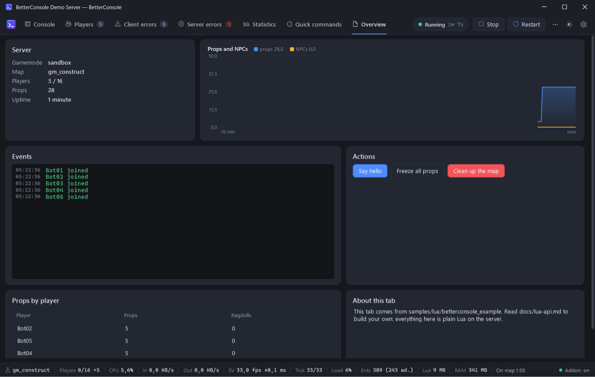
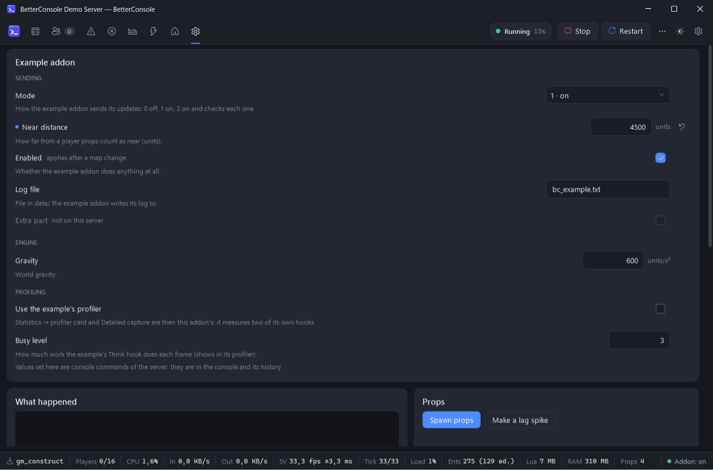

# Lua API — tabs, statistics, player menu and status items from server addons

Any server addon can show its own information in BetterConsole: a tab with widgets (key numbers, text,
key/value list, table, log, chart, buttons, settings forms), numbers and charts on the Statistics tab,
items in the right-click menu of the Players tab and in the status bar, explanations of lag spikes, even
a profiler of its own in place of the built-in one. Everything here is server-side Lua.



## Ground rules

- The global table `BetterConsole` exists on every server that has the companion addon, **whether or
  not** BetterConsole is connected. While it is not connected every call does nothing, so you can
  call it unconditionally. Check `if BetterConsole then` only to support servers without the addon.
- Define your tab **once, when your addon loads** (or in `BetterConsoleReady`). BetterConsole remembers
  every tab, widget, the last value of each widget and the last lines of logs and charts, and sends
  them again after a map change or when the app reconnects.
- Updates are cheap (a small JSON message through a pipe on another thread), but there is no point
  in updating faster than people can read: once a second or slower is plenty.
- `BetterConsole.IsActive()` tells you whether the app is connected right now — skip expensive data
  collection while it is not. `tab:OnShow` tells you when the user looks at your tab.
- Errors in your callbacks (`onAction`, `onChange`, `OnShow`, `OnSpike`, `filter`, a profiler's `start`
  …) are caught and reported as Lua errors that name your tab, widget or id; they never break the
  companion.

### Which version has what

The companion addon is updated with BetterConsole, so a server may run an older one than your addon
expects. Old calls keep working in every new version. Find a newer function by its presence instead of
comparing versions (`BetterConsole.Version` is there too):

```lua
if isfunction(tab.Form) then
    tab:Form("settings", { fields = { ... } })      -- 0.4
else
    tab:KeyValue("settings"):Set({ ... })            -- older companion: show the values at least
end
if isfunction(BetterConsole.SetProfiler) then BetterConsole.SetProfiler(myProfiler) end
```

| Version | Added |
|---|---|
| 0.4 | `tab:Form`, `tab:OnChange`, `tab:OnShow`, button `fields` (and the `values` of `onAction`), table `key` / `sort` / `links` / column options, `BetterConsole.SetProfiler`, `ProfilerReport`, `IsProfiling`, `IsCapturing`, `BetterConsole.Stats:OnSpike`, hooks `BetterConsoleProfiler` and `BetterConsoleCapture` |
| 0.3 | `tab:Stat`, `widget:Remove`, `BetterConsole.Stats`, the player menu (`AddPlayerAction` …), `SetStatus` with options |

## Quick example

```lua
if not BetterConsole then return end

local tab = BetterConsole.AddTab("myjobs", { title = "Jobs", order = 50 })

local summary = tab:KeyValue("summary", { title = "Now", span = 4 })
local chart   = tab:Chart("queue", { title = "Queue length", span = 8,
                                     series = { { name = "waiting", color = "#F2B33D" } } })
local log     = tab:Log("log", { title = "Events", max = 300 })
local buttons = tab:Buttons("actions", { buttons = {
    { id = "flush", text = "Flush the queue", style = "danger", confirm = "Drop every waiting job?" },
} })

tab:OnAction(function(widgetId, actionId)
    if actionId == "flush" then
        Jobs.Flush()
        log:Append("Queue flushed from the console", Color(240, 90, 90))
    end
end)

timer.Create("myjobs_console", 2, 0, function()
    if not BetterConsole.IsActive() then return end
    summary:Set({ Workers = Jobs.Workers(), Waiting = #Jobs.Queue, Done = Jobs.DoneToday })
    chart:Push(#Jobs.Queue)
end)

hook.Add("JobFailed", "myjobs_console", function(job, err)
    log:Append(job.name .. ": " .. err, Color(255, 120, 90))
end)
```

A complete, working example is in [`samples/lua/betterconsole_example`](../samples/lua/betterconsole_example):
`bc_example.lua` (a tab, the Statistics tab, the player menu) and `bc_example_settings.lua` (a form, buttons with
a dialog, live tables, a profiler of its own, explanations of lag spikes).

## Tabs

### `BetterConsole.AddTab(id, options) → tab`

Creates the tab, or returns the existing one with that id (and updates its title / order / icon).

| Option | Type | Default | |
|---|---|---|---|
| `title` | string | the id | text on the tab |
| `order` | number | 100 | position: lower is more to the left; built-in tabs use 0–40 |
| `icon` | string | a document | the hex code of a [Segoe Fluent Icons](https://learn.microsoft.com/windows/apps/design/style/segoe-fluent-icons-font) glyph (`"E7FC"`), or a letter or emoji. When the app shows only the icons of its tabs (a narrow window, or the user's choice), this is all that tells your tab apart |

### `BetterConsole.GetTab(id) → tab | nil`

### `tab:Remove()`

Removes the tab from BetterConsole and forgets it.

### `tab:OnAction(function(widgetId, actionId, values) end)`

Called when a button of this tab is pressed in BetterConsole. (Each widget may also have its own
`onAction` option, see *Buttons*.) `values` are what the button's dialog asked for (see *Buttons*),
`nil` for a button without `fields`. The callback runs on the server; errors in it are reported as Lua
errors.

### `tab:OnChange(function(widgetId, fieldId, value) end)`

Called when a field of a form of this tab that is not bound to a console variable is changed in
BetterConsole (a form's own `onChange` option wins). `value` is a number for `"number"` fields,
`true` / `false` for `"bool"`, a string otherwise. See *Form*.

### `tab:OnShow(function(shown) end)`

Called with `true` when the user opens this tab in BetterConsole (in any window) and with `false` when
they leave it, switch to another server or the app disconnects. Collect expensive data for the tab only
while it is seen, as the companion measures the CPU of each player only while the Players tab is open.
Works for `BetterConsole.Stats` too. Registered while the tab is already shown, it is called with
`true` at once.

```lua
tab:OnShow(function(shown)
    if shown then
        Refresh()
        timer.Create("myaddon_console", 1, 0, Refresh)
    else
        timer.Remove("myaddon_console")
    end
end)
```

### `tab:Widget(id) → widget | nil`

## Widgets

Widgets are laid out left to right on a 12-column grid and wrap like words. Options common to every
widget:

| Option | Type | Default | |
|---|---|---|---|
| `title` | string | none | heading of the card |
| `span` | 1–12 | 12 | width in twelfths of the tab (narrow windows show everything full width) |

Every widget has `widget:Clear()` and `widget:Remove()` (it leaves the tab; the constructor adds
it back). Calling a constructor again with the same id updates the widget's options. Ids are unique
per tab: a Stat and a Chart with the same id are one widget, and the second replaces the first.

### Stat — `tab:Stat(id, options)`

A key number: the title in small capitals, a big value, a line under it — the cards at the top of the
Statistics tab. On a tab of your own it is 3 twelfths wide unless `span` says otherwise.

| Option | |
|---|---|
| `tooltip` | shown when the pointer is over the card |
| `order` | on the Statistics tab: its place among the built-in numbers (see below) |

```lua
local money = tab:Stat("money", { title = "Money", tooltip = "In all wallets" })
money:Set("$1.2M", "40 wallets")                                -- value, line under it
money:Set({ value = "$0", sub = "empty", color = Color(240, 90, 90) })
```

### Text — `tab:Text(id, options)`

```lua
local note = tab:Text("note", { title = "Read me" })
note:Set("Any text. It can be selected and copied.")
```

### KeyValue — `tab:KeyValue(id, options)`

Two columns, label and value.

```lua
info:Set({ Map = game.GetMap(), Players = player.GetCount() })   -- sorted by key
info:Set({ { "First", 1 }, { "Second", 2 } })                     -- your order
```

Values may be strings, numbers or booleans.

### Table — `tab:Table(id, options)`

| Option | |
|---|---|
| `columns` | list of columns: a title, or `{ text = "ms/s", align = "right", width = 80 }` — `align` `"left"` (default), `"right"` or `"center"`; `width` in pixels, `"*"` (a share of what is left, the default; `"2*"` two shares) or `"auto"` |
| `key` | the number of the column that identifies a row (1 = the first): see below |
| `sort` | the order it starts with: `{ column = 2, descending = true }` |
| `links` | `true`: cells like `addons/x/lua/y.lua:12` open in the user's editor with a double-click |

```lua
local t = tab:Table("top", { title = "Richest", key = 1,
    columns = { "Player", { text = "Money", align = "right", width = 100 }, "Job" },
    sort = { column = 2, descending = true } })
t:Set({ { "Alice", 52000, "Mayor" }, { "Bob", 1200, "Cook" } })
```

Each `Set` sends all rows (up to 2000), and the table is **updated in place**: with `key` a row with a
key that was there before keeps its place, selection and scroll position and only its cells change, new
keys are added and missing ones removed; without `key` rows are matched by position. Send the whole
table every second if you like — nothing blinks. The user sorts by clicking a header (numbers as
numbers: `"41 %"`, `"12.5 ms"` and `1200` sort by their value, text without regard to case); while the
pointer is over the table the order holds still and new rows wait at the end.

### Log — `tab:Log(id, options)`

| Option | Default | |
|---|---|---|
| `max` | 300 | lines kept (10–5000) |

```lua
log:Append("Something happened")
log:Append("Something bad happened", Color(255, 90, 90))   -- or "#FF5A5A"
```

The log follows new lines while it is scrolled to the end.

### Chart — `tab:Chart(id, options)`

A time series chart, one value per series and push.

| Option | Default | |
|---|---|---|
| `series` | one series "Value" | list of `{ name = "...", color = Color(...) or "#RRGGBB" }` |
| `unit` | none | shown after values, e.g. `"ms"` |
| `max` | 600 | points kept per series (10–5000) |

```lua
local c = tab:Chart("perf", { title = "Queue", series = { { name = "waiting" }, { name = "running" } }, unit = "jobs" })
c:Push(#waiting, #running)        -- or c:Push({ #waiting, #running })
```

Points are stamped with the time they were pushed; the chart shows the last 10 minutes.

### Buttons — `tab:Buttons(id, options)`

| Button field | | |
|---|---|---|
| `id` | required | passed to your action handler |
| `text` | the id | label |
| `style` | `"default"` | `"primary"` or `"danger"` |
| `confirm` | none | if set, BetterConsole asks this question before sending the action (with `fields`: the text of the dialog) |
| `fields` | none | a dialog before it is sent — the same fields as the items of the player menu: text, `type = "number"`, `choices` (see *Player menu*) |

A widget can carry its own handler: `tab:Buttons("x", { buttons = {...}, onAction = function(widgetId, actionId, values) end })`.
`widget:Set({ ...buttons... })` replaces the buttons.

```lua
tab:Buttons("tools", { buttons = {
    { id = "spawn", text = "Spawn props", fields = {
        { id = "count", text = "How many", type = "number", default = 5 },
        { id = "model", text = "Model", choices = { "models/props_c17/oildrum001.mdl", "models/props_junk/wood_crate001a.mdl" }, editable = true },
    } },
}, onAction = function(widgetId, actionId, values)
    for i = 1, math.Clamp(values.count, 1, 50) do SpawnProp(values.model) end   -- values.count is a number
end })
```

Number fields are checked in the app (a number is needed); the values arrive as numbers. Without
`fields` everything is as before and `values` is `nil`.

### Form — `tab:Form(id, options)`

Settings of your addon: a row per field, its text on the left (with the help under it) and a switch, a
number, a text box or a list on the right; in a narrow window the control goes under the text, and
compact mode makes it all smaller like the rest of the app.

 A field is bound to a **console variable** of the server (`convar`) or holds a **value
of your own**.

```lua
local form = tab:Form("network", {
    title = "Network", span = 12,
    fields = {
        { type = "header", text = "Sending" },
        { convar = "myaddon_mode", type = "choice",
          choices = { { "0 · off", "0" }, { "1 · on", "1" }, { "2 · on, with checks", "2" } } },
        { convar = "myaddon_distance", type = "number", min = 0, max = 20000, step = 500, unit = "units" },
        { convar = "myaddon_enabled", type = "bool", note = "applies after a map change" },
        { convar = "myaddon_log_file", type = "text" },
        { convar = "myaddon_extra_part", type = "bool", missing = "show" },   -- another part, maybe not installed
        { id = "level", text = "Level", type = "number", value = 3, min = 1, max = 6 },   -- not a variable
        { type = "note", text = "Changes are console commands of the server." },
    },
    onChange = function(widgetId, fieldId, value) end,   -- fields without a convar (or tab:OnChange)
})
form:Set({ level = 4 })                                   -- values of fields without a convar
```

| Field | |
|---|---|
| `id` | unique in the form; default: the name of `convar` |
| `convar` | the field is bound to this console variable of the server |
| `type` | `"bool"` (a switch), `"number"`, `"text"`, `"choice"` (a list), `"header"` (a heading inside the form, its text in `text`), `"note"` (a line of explanation). Default: `"choice"` with `choices`, `"bool"` / `"number"` by `value` or `default`, else `"text"` |
| `text` | the label; default: the name of the variable |
| `help` | shown under the label (a few lines; up to 600 characters of it in the tooltip); default: the variable's help text (`GetHelpText`) |
| `value` | the value of a field without a variable |
| `default` | the default value: the field is marked and gets a reset button when its value is another; for a variable `GetDefault()` |
| `min`, `max`, `step`, `unit` | for numbers: the range (for a variable `GetMin()` / `GetMax()` unless given), the step of ↑ / ↓ and the mouse wheel, a unit after the box |
| `choices` | a list of values or pairs `{ "shown text", value }`, as for the fields of the player menu; `editable = true` lets the user type a value of their own |
| `readonly` | only shown |
| `confirm` | a question before a change is applied (`{value}` is replaced) |
| `note` | a short dimmed note after the label ("applies after a map change") |
| `missing` | for a variable that is not on the server: `"hide"` (default) leaves the field out, `"show"` shows it greyed out with "not on this server" — list the optional variables of the other parts of your addon. A variable created later (another addon loading after yours) appears within a second while the tab is shown |

How it behaves:

- **Values stay fresh**: the companion sends the values of bound variables, and again within a second
  when they change from the console, rcon or another addon (it checks once a second, only while the tab
  is shown).
- **A change** made in the app is checked by type and `min` / `max` — in the app, and again on the
  server. For a variable the companion runs `name value` as a console command of the server; the app
  shows it in the console and puts it in the command history like a command typed there. For a field
  without a variable it calls `onChange(widgetId, fieldId, value)` (a number for `number`, `true` /
  `false` for `bool`, else a string) and remembers the value. A refused value (out of range, not a
  number) is reported to the user and the control goes back to the server's value.
- Switches and lists apply at once; numbers and texts on Enter or when the box loses the focus (Esc
  puts the value back).
- **Protected variables** (`FCVAR_PROTECTED`, and those GMod does not give to Lua such as
  `sv_password`) show as hidden and cannot be changed. Quotes and line breaks cannot be set into a
  variable.
- Calling `tab:Form` again with the same id changes the fields; values of your own fields stay.

## The Statistics tab

`BetterConsole.Stats` is the built-in Statistics tab with the methods of a tab of your own: Stat cards
join the key numbers at the top, charts join the charts (two to a row unless `span = 12`, and they
follow the tab's 1 min … 1 hour window), any other widget goes below the charts. `order` places a card
or chart among the built-in ones:

| Order | Numbers | Charts |
|---|---|---|
| 10 | `fps` | `chart.frame` |
| 20 | `frame` | `chart.load` |
| 30 | `load` | `chart.rate` |
| 40 | `tick` | `chart.memory` |
| 50 | `cpu` | `chart.network` |
| 60 | `memory` | `chart.players` |
| 70 | `lua` | `chart.entities` |
| 80 | `players` | |
| 90 | `entities` | |
| 100 | `network` | |
| 110 | `uptime` | |

Without `order` your parts come after the built-in ones. The two sections below the charts are
`spikes` (lag spikes) and `profiler`.

A chart keeps what your addon pushed in this Lua state: after a map change it starts again, and
after BetterConsole restarts it gets back the last `max` points (600 by default). For an hour of
history push once a minute or raise `max`.

```lua
local stats = BetterConsole.Stats
local money = stats:Stat("money", { title = "Money", order = 85 })    -- after Players
local chart = stats:Chart("money_chart", { title = "Money", unit = "$" })
timer.Create("myeconomy_stats", 1, 0, function()
    local total = MyEconomy.Total()
    money:Set(string.Comma(total), #player.GetHumans() .. " wallets")
    chart:Push(total)
end)
```

### `BetterConsole.Stats:Hide(id, ...)` / `BetterConsole.Stats:Show(id, ...)`

Hides (shows again) built-in parts by their ids from the table above, for example a number your
addon shows better: `BetterConsole.Stats:Hide("players", "chart.players")`.

### `BetterConsole.Stats:OnSpike(id, fn)` — explaining long frames

An addon that measures frames itself knows more about a long frame than the companion sees. `fn(spike)`
is called for each long frame when the summary with the lag spikes goes to the app (once a second), so
your own numbers of that frame are ready by then.

```lua
BetterConsole.Stats:OnSpike("myaddon", function(spike)
    -- spike: ms (the frame), busy (CPU ms), st (SysTime of the frame after it), time, phys, heap, gc,
    -- ents, joined, timer, cbs — what the companion knows already
    local mine = MyAddon.FrameCost(spike.st)          -- your own measure of that frame
    if not mine then return end
    spike.causes = { { text = "server.dll 45%", kind = "accent", tooltip = "Where the game thread was" } }
    spike.lua = { { text = "net my_message", ms = 12.5, tooltip = "From Bob", src = "addons/x/lua/y.lua:30" } }
    spike.engine = { { text = "SendClientMessages", ms = 20.1, tooltip = "..." } }
end)
BetterConsole.Stats:OnSpike("myaddon", nil)   -- removes it
```

- `causes`: chips of the row; `kind` is the colour, as the built-in chips: `"danger"`, `"warning"`,
  `"accent"` (default) or `"muted"`; `src` makes it a link to a Lua file (double-click).
- `lua`: added after the frame's own Lua part (the slowest hooks, timers and net messages of the
  detailed capture).
- `engine`: shown as the engine's part of the frame, in place of vprof's report — the app does not wait
  for a vprof report for that frame.
- Each function gets empty lists to fill (assign them or `table.insert` into them): several addons add to
  one row, each under its own id, without replacing each other's parts. Up to 12 entries per list.

## Player menu

Items of your own in the right-click menu of the Players tab. The menu works on the selected players:
a command runs once for each of them, an `onRun` function once with all of them.

### `BetterConsole.AddPlayerAction(id, options) → action`

| Option | Default | |
|---|---|---|
| `text` | the id | the menu item |
| `icon` | none | hex code of a Segoe Fluent Icons glyph (`"E7BA"`) or a letter |
| `order` | 300 | position: kick 100, ban 110, group 120, gag 200, mute 210, jail 220, copy 400–420, profile 430. A separator goes between hundreds, so 300 makes a section of its own |
| `command` | | a console command, run for each player. `{target}` addresses the player (as ULX does, quoted) — use it for targets; `{userid}`, `{steamid}` (write `"{steamid}"`: the engine splits words at `:`), `{steamid64}`, `{name}` (for messages only: a name such as `*` or `@` would be a ULX target of its own), and `{field}` for each field of the dialog (a field cannot have one of these names). Names and typed values lose quotes, semicolons and line breaks. A command without a player placeholder runs once |
| `onRun` | | `function(players, values)` on the server instead (it wins when both are given): the selected players that are still there, the values of the dialog by field id (numbers for `type = "number"`). One of `command` and `onRun` is needed |
| `fields` | none | a dialog before it runs, see below |
| `confirm` | none | a question before it runs; `{players}`, `{name}`, `{count}` are replaced |
| `danger` | false | the dialog's button is red |
| `filter` | none | `function(ply) → bool`: the item is only for the players it accepts. It runs with each player list (every second or two), so keep it cheap. Two items with opposite filters make a toggle |
| `bots` | true | false: not for bots |
| `multi` | true | false: only while a single player is selected |

Fields: `{ id = "reason", text = "Reason", default = "" }` (text),
`{ id = "minutes", text = "Minutes", type = "number", default = 5 }`,
`{ id = "where", text = "Where", choices = { "spawn", "jail" }, default = "spawn" }` (a drop-down;
`{ { "Shown text", "value" }, ... }` for other values than texts, `editable = true` to allow typing).

```lua
-- A toggle: each selected player gets the item that fits.
BetterConsole.AddPlayerAction("freeze", {
    text = "Freeze", icon = "E769",
    filter = function(ply) return not ply:IsFrozen() end,
    onRun = function(plys) for _, p in ipairs(plys) do p:Freeze(true) end end,
})
BetterConsole.AddPlayerAction("unfreeze", {
    text = "Unfreeze", icon = "E768",
    filter = function(ply) return ply:IsFrozen() end,
    onRun = function(plys) for _, p in ipairs(plys) do p:Freeze(false) end end,
})

-- No Lua at all: a command of your admin mod, with a dialog.
BetterConsole.AddPlayerAction("slap", {
    text = "Slap", order = 230,
    fields = { { id = "damage", text = "Damage", choices = { "0", "10", "50" }, default = "0" } },
    command = "ulx slap {target} {damage}",
})
```

### `BetterConsole.RemovePlayerAction(id)` (or `action:Remove()`)

### `BetterConsole.HidePlayerAction(id, ...)` / `BetterConsole.ShowPlayerAction(id, ...)`

Hides built-in items: `kick`, `ban`, `group`, `gag` (and Ungag), `mute` (and Unmute), `jail` (and
Unjail), `copy` (the three copy items), `profile`. A server with its own ban system can hide `ban` and
add its own item in its place (`order = 110`).

## A profiler of your own

Your addon may have its own way of measuring (a native module that samples the game thread and reads
the engine's profiler, say). Next to the built-in profiler both would wrap the same hooks, timers and
net handlers and each would measure the other's wrappers; and the detailed capture of lag spikes types
`vprof_on` and `vprof_dump_spikes`, which make the engine restart its profile every frame — any other
reader of the engine's profiler in that process gets broken numbers. Hand the profiler card and the
detailed capture to your addon instead:

```lua
BetterConsole.SetProfiler({
    name = "My profiler",                        -- on the profiler card
    info = "What it measures, what it costs",    -- in place of the built-in description
    start = function() end,                      -- "Start profiling"; may return false, "why not"
    stop = function() end,
    startCapture = function() end,               -- "Detailed capture" of lag spikes; may return false, "why not"
    stopCapture = function() end,
    vprof = false,                               -- the app types no vprof command for the capture
})
BetterConsole.SetProfiler(nil)                   -- the built-in profiler again
```

- While a provider is set the built-in profiler and capture install nothing (no hook, timer or net
  wrapper of theirs); the app's *Start profiling* and *Detailed capture* call your functions and their
  buttons follow your state. What was running when you call `SetProfiler` (the built-in profiler or
  capture, or the provider before yours) is stopped first; the user starts it again.
- `start` / `startCapture` may refuse: `return false, "Not with nobody on"` — the user gets the reason
  as a notification and nothing changes. An error in them counts as a refusal and is reported.
- With `vprof = false` the app types none of `vprof_on`, `vprof_dump_spikes`, `vprof_off` — not when
  the capture starts, not after a reconnect. The engine's part of the lag spike rows then comes from
  your addon (`OnSpike`, `spike.engine`). Without it the capture still turns on vprof as before.
- When the app disconnects the companion calls `stop` / `stopCapture`, as it stops the built-in one.
- The companion's timer detour stays (it is installed at start-up and only remembers the slowest timer
  of a frame for the lag spikes: two `SysTime` calls per timer call).

### `BetterConsole.ProfilerReport(report)`

While profiling, about once a second: the same tables the built-in profiler sends (ignored while your
profiler is not running).

```lua
BetterConsole.ProfilerReport({
    hooks = { { k = "Think / myhook", ms = 0.8, n = 33, max = 0.1, src = "addons/x/lua/y.lua:12", kb = 4.5 }, ... },
    timers = { ... }, netin = { ... }, netout = { ... },
    ents = { { k = "prop_physics", n = 120 }, ... }, entTotal = 1500,
    since = 42,                                   -- seconds of profiling
    extra = { { id = "modules", title = "Game thread by module", columns = { "Module", "of busy" },
                rows = { { "server.dll", "41 %" }, ... } } },
})
```

| Row field | |
|---|---|
| `k` | the name ("Think / myhook", a timer, a net message) |
| `ms` | milliseconds per second |
| `n` | calls per second |
| `max` | the longest call, ms |
| `b` | bytes per second (net messages) |
| `kb` | Lua memory allocated per second, KB — a column of its own |
| `src` | where the function is (`path/file.lua:12`: a tooltip, double-click opens it) |

A column for which no row has a value is not shown (`max` of a profiler that does not measure it,
`kb` of the built-in one). `extra` are more tables under the built-in ones, with the options of
`tab:Table` (`columns`, `key`, `sort`, `links`; `key` is the first column unless you say otherwise), updated
in place from report to report. Up to 300 rows per kind, 2000 per extra table.

### `BetterConsole.IsProfiling()`, `BetterConsole.IsCapturing()` → bool

### Hooks `BetterConsoleProfiler(on)`, `BetterConsoleCapture(on)`

Called each time profiling or the detailed capture starts or stops — the built-in ones or yours.

## Status bar

### `BetterConsole.SetStatus(id, text [, tooltip [, color]])`

Adds or updates a text item on the right of the status bar.

```lua
BetterConsole.SetStatus("myjobs", "Jobs 12", "Waiting jobs", Color(242, 179, 61))
```

### `BetterConsole.SetStatus(id, options)`

The same with a table, to look like the built-in items: a dimmed `label` before the `text`.

| Option | |
|---|---|
| `text` | the value |
| `label` | dimmed before it ("Jobs") |
| `tooltip`, `color` | as above |
| `name` | what the menu of the status bar calls it (right-click the status bar: the user can hide any item there); default the label, else the id |
| `order` | position among the items of addons (500) and plugins (1000 unless they say otherwise) |

```lua
BetterConsole.SetStatus("myjobs", { label = "Jobs", text = #Jobs.Queue, tooltip = "Waiting jobs", name = "Job queue" })
```

### `BetterConsole.RemoveStatus(id)`

## Notifications

### `BetterConsole.Notify(text [, kind])`

A toast in the corner of the BetterConsole window. `kind`: `"info"` (default), `"success"`,
`"warning"`, `"error"`.

## Talking to C# plugins

### `BetterConsole.SendToApp(type, data)`

Sends any table to the app; C# plugins receive it in `ctx.Bridge.MessageReceived` with that `type`.

### Hook `BetterConsoleMessage(type, data)`

A plugin's `ctx.Bridge.Send(type, data)` arrives here:

```lua
hook.Add("BetterConsoleMessage", "myaddon", function(msgType, data)
    if msgType == "myaddon.reload" then MyAddon.Reload() end
end)
```

### Hook `BetterConsoleReady()`

Called every time BetterConsole (re)connects — after a map change too. Your tabs are already resent
by then; use it to push data that you only compute on request.

### `BetterConsole.IsActive() → bool`

## What the companion addon does by itself

You do not need any of this to use BetterConsole — it is here so you know what runs on your server
while BetterConsole is connected:

- `hook.Add("OnLuaError")` and `hook.Add("OnClientLuaError")` forward errors (repeats of the same
  error at most once a second, with a count).
- A `Think` and a `Tick` hook measure frame and tick times; once a second a summary is sent. The
  `Think` hook costs about a microsecond and does not grow with the number of entities:
  `OnEntityCreated` / `EntityRemoved` hooks count the entities a long frame created or removed.
- While a tab with a form is shown: its console variables are read once a second.
- `timer.Create` / `timer.Simple` / `timer.Adjust` are wrapped from the start so the profiler can
  name timers; while the profiler is off the wrapper just calls your function.
- While the **Players** tab is open: `StartCommand` / `FinishMove` hooks and a `net.Incoming`
  wrapper measure the CPU per player.
- The player list (every one or two seconds) reads `cl_updaterate` and `cl_cmdrate` of each player
  (`GetInfoNum`) and runs the `filter` functions of player menu items.
- While the **profiler** or the **detailed capture** runs: hook functions, `net.Receive` handlers and
  `net.Start` / `net.Send*` are wrapped. Everything is restored when it stops. Nothing of it while an
  addon's profiler is set (`BetterConsole.SetProfiler`).
- The command `betterconsole_exec <hex>` (server console only) runs commands with non-ASCII text.
- A console variable `betterconsole_probe` marks where the engine's command list starts (for
  auto-completion).

None of it is active when the server runs without BetterConsole.
