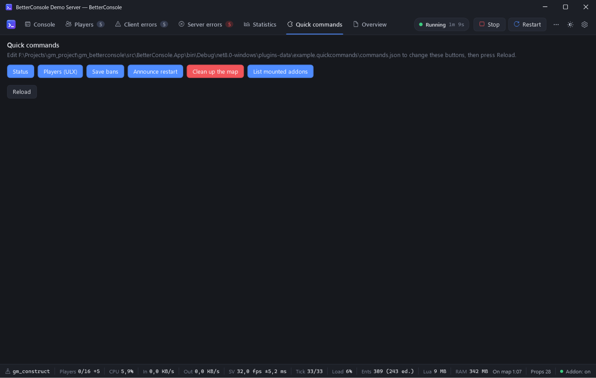

# C# plugins

A plugin is a .NET 8 class library with a class that implements `IConsolePlugin` from
`BetterConsole.Sdk`. It can add tabs with any WPF content, status bar items and notifications,
watch the console output, the server state and the statistics, run commands, and exchange messages
with Lua on the server.



## Make one in five minutes

```powershell
dotnet new classlib -n HelloPlugin -f net8.0-windows
cd HelloPlugin
```

Edit `HelloPlugin.csproj`:

```xml
<Project Sdk="Microsoft.NET.Sdk">
  <PropertyGroup>
    <TargetFramework>net8.0-windows</TargetFramework>
    <UseWPF>true</UseWPF>
    <EnableDynamicLoading>true</EnableDynamicLoading>
  </PropertyGroup>
  <ItemGroup>
    <!-- Reference the SDK, but do not ship it: BetterConsole has it already. -->
    <Reference Include="BetterConsole.Sdk">
      <HintPath>path\to\BetterConsole.Sdk.dll</HintPath>
      <Private>false</Private>
    </Reference>
  </ItemGroup>
</Project>
```

(Build `src/BetterConsole.Sdk` from this repository to get `BetterConsole.Sdk.dll`, or reference the
project directly as [the sample](../samples/QuickCommandsPlugin/QuickCommandsPlugin.csproj) does.)

```csharp
using System.Windows.Controls;
using BetterConsole.Sdk;

public sealed class HelloPlugin : IConsolePlugin
{
    public string Id => "me.hello";            // unique, used for the data folder
    public string Name => "Hello";
    public string Description => "Says hello when someone joins.";

    private IStatusItem? _joins;
    private int _count;

    public void Initialize(IPluginContext ctx)
    {
        ctx.Ui.AddTab("hello", "Hello", () => new TextBlock { Text = "Hello from a plugin!", Margin = new(16) });
        _joins = ctx.Ui.AddStatusItem("hello.joins", "Joins 0", "Players who joined since start");

        ctx.Console.LineReceived += (_, e) =>
        {
            if (e.Line.Text.Contains(" connected"))
            {
                _joins!.Text = $"Joins {++_count}";
                ctx.Server.SendCommand("say Welcome!");
            }
        };
    }
}
```

Build it and copy the DLL to `plugins\HelloPlugin\HelloPlugin.dll` next to `BetterConsole.exe`
(one folder per plugin; extra DLLs your plugin needs go into the same folder). Restart BetterConsole.
*Settings → Plugins* lists the plugins and lets you switch them off.

## The API

Everything is called on the UI thread, and every event is raised on the UI thread, so you can touch
WPF objects directly. Full definitions with comments: [`src/BetterConsole.Sdk/IPluginContext.cs`](../src/BetterConsole.Sdk/IPluginContext.cs).

### `IConsolePlugin`

| Member | |
|---|---|
| `Id`, `Name`, `Description` | identity |
| `Initialize(IPluginContext)` | called once after the main window exists |
| `Shutdown()` | called when BetterConsole closes (optional) |

### `IPluginContext`

| Member | |
|---|---|
| `Server` | `IServer`: state, process id, game folder, latest numbers, start/stop/restart, `SendCommand` |
| `Console` | `IConsoleOutput`: `LineReceived` event, `WriteLine` into the console tab |
| `Bridge` | `ILuaBridge`: messages to and from the companion addon |
| `Ui` | `IUiHost`: tabs, status items, notifications, theme |
| `DataDirectory` | a folder of your own: `plugins-data\<Id>` |
| `Log(message)` | writes to `logs\betterconsole.log` |

### `IServer`

```csharp
ServerState State { get; }                    // Stopped, Starting, Running, Stopping, Crashed
event EventHandler<ServerStateChangedEventArgs> StateChanged;
int? ProcessId { get; }
string GameDirectory { get; }                 // ...\garrysmod
ServerSnapshot? Latest { get; }               // CPU, memory, FPS, tick, players, entities, net, map...
event EventHandler<ServerSnapshot> SnapshotUpdated;   // about once a second
void SendCommand(string command);             // like typing it; non-ASCII works
Task StartAsync(); Task StopAsync(); Task RestartAsync();
```

### `IConsoleOutput`

```csharp
event EventHandler<ConsoleLineEventArgs> LineReceived;   // every line that reaches the console tab
void WriteLine(string text, uint argb = 0);              // a line of your own (0xFFRRGGBB)
```

`ConsoleLine` has `Text`, `Time`, `Kind` (`Output`, `Command`, `App`, `AppError`) and `Spans` (colour
runs). Lua errors never reach `LineReceived`; read them from the bridge (`"err"` messages) instead.

### `ILuaBridge`

```csharp
bool IsConnected { get; }
event EventHandler<bool> ConnectionChanged;
event EventHandler<BridgeMessage> MessageReceived;   // Type + Data (System.Text.Json.JsonElement)
void Send(string type, object? data = null);
```

- Lua → plugin: `BetterConsole.SendToApp("myaddon.stats", { kills = 5 })` arrives with
  `Type == "myaddon.stats"` and `Data` = the table.
- Plugin → Lua: `ctx.Bridge.Send("myaddon.reload", new { force = true })` arrives in the Lua hook
  `BetterConsoleMessage(type, data)`.
- You also see the built-in messages (`"stats"`, `"players"`, `"err"`, …) — handy for your own
  dashboards. Their fields are described in [how-it-works.md](how-it-works.md#messages).

### `IUiHost`

```csharp
void AddTab(string id, string header, Func<FrameworkElement> content, int order = 1000);  // created when first shown
void AddTab(string id, string header, string icon, Func<FrameworkElement> content, int order = 1000);  // icon: a Segoe Fluent Icons glyph ("") or a short text
void RemoveTab(string id);
IStatusItem AddStatusItem(string id, string text, string? tooltip = null, int order = 1000);
void Notify(string message, NotifyKind kind = NotifyKind.Info);
string ThemeName { get; }
event EventHandler<string> ThemeChanged;
```

`IStatusItem` has `Text`, `Tooltip`, `Visible` and `Argb` (text colour, 0 = theme default).

## Looking like the rest of the app

Use the application's resources with `SetResourceReference` (or `{DynamicResource}` in XAML) so
your controls follow the theme:

- Brushes: `Brush.Background`, `Brush.Panel`, `Brush.Surface`, `Brush.Border`, `Brush.Text`,
  `Brush.TextSecondary`, `Brush.TextMuted`, `Brush.Accent`, `Brush.Danger`, `Brush.Warning`,
  `Brush.Success`, `Brush.Chart1` … `Brush.Chart6` — every name of [themes.md](themes.md) with the
  `Brush.` prefix (`Color.` for the colour itself).
- Styles: `Btn`, `Btn.Primary`, `Btn.Danger`, `Btn.Ghost`, `Btn.Icon`, `Toggle.Ghost`, `Card`
  (a `Border`), `Pill`, `Text.Title`, `Text.Muted`, `SelectableText` (a read-only `TextBox`).
- Fonts: `Font.Ui`, `Font.Mono`, `Font.Icons` (Segoe Fluent Icons).

```csharp
var card = new Border { Child = content };
card.SetResourceReference(FrameworkElement.StyleProperty, "Card");
```

Text boxes, combo boxes, check boxes, scroll bars, data grids, menus and tooltips are styled
automatically.

## The sample

[`samples/QuickCommandsPlugin`](../samples/QuickCommandsPlugin) — a *Quick commands* tab with buttons
read from `plugins-data\example.quickcommands\commands.json`, and a status item with the time on the
current map. The release ships it in `plugins\QuickCommands`.

## Tips

- Plugins run inside BetterConsole: an exception in an event handler is caught and shown as a
  notification, but do not block the UI thread — use `async`/`Task.Run` for slow work.
- Each plugin is loaded into its own `AssemblyLoadContext`, so your dependencies cannot clash with
  BetterConsole's.
- There is no hot reload: restart BetterConsole after replacing a plugin DLL.
