# User guide

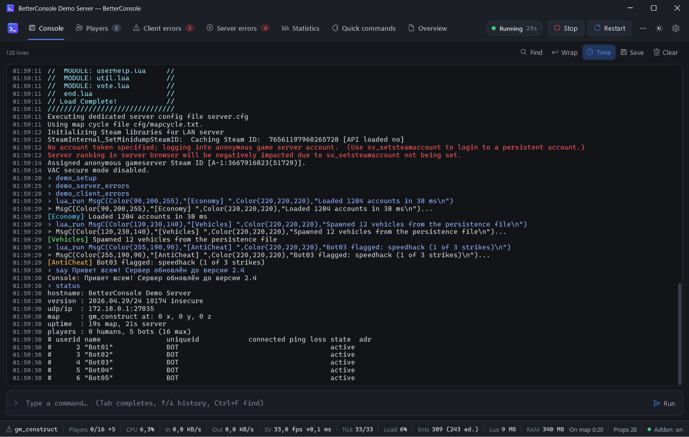

## The window

- **Tabs** along the top. Badges show counts: players online, players with client errors, distinct
  server errors (red while there are errors you have not looked at). When the tabs do not fit with
  their titles they show only their icons (the title is in the tooltip); right-click the tab bar (or
  Settings → Appearance) to always show titles or always only icons. Tabs that still do not fit are
  in the list behind the arrow next to them; Ctrl+1…9 and Ctrl+Tab switch tabs too.
- **Server controls** on the right: the state (*Running 1h 12m*; hover it for the CPU, the schedule
  and Always run), Start / Stop / Restart, the `…` menu (kill a hung server, CPU affinity and
  priority, the start / stop journal, open the server folder, documentation), the theme menu and
  Settings.
- **Status bar** at the bottom.
- **Toasts** in the bottom right corner for things that need your attention (a crash, a finished
  action). With several servers, a toast of a server you are not looking at starts with its name.
- With [several servers](#several-servers-multi-console) the **logo** in the top left corner opens the
  server list.

## Console

The output of the server, with the colours addons print in (`MsgC`).

- **Reading old output**: scroll up with the mouse wheel, the scroll bar or PageUp. The view stays
  where you are while new lines keep arriving; the **N new lines** button in the corner brings you
  back to the end and the console follows the output again. Scrolling to the end by hand does the
  same.
- **Find**: Ctrl+F. Enter / Shift+Enter (or F3 / Shift+F3) jump between matches; the buttons next
  to the box match case, whole words or a regular expression. Esc closes it.
- **Time**: the time each line arrived, in a margin (not part of the text, so copying skips it).
- **Wrap**: break long lines instead of scrolling sideways.
- **Save**: the whole console as a `.log` file, with dates.
- **Clear**: empties the tab (the server is not affected).
- Links are clickable with Ctrl+click. Text can be selected; Ctrl+C copies.

Lua errors are taken out of the console (they would otherwise flood it) and go to the error tabs.
You can keep them in the console too: *Settings → Keep Lua errors out of the console*.

Lines BetterConsole writes itself start with `▸` (notices) or `▲` (problems); commands you ran start
with `›`.

### Running commands

Type into the box below the output and press Enter.

| Key | |
|---|---|
| **Tab** | insert the highlighted suggestion (the first one if you did not choose) |
| **↑ / ↓** | with suggestions open: choose one (it goes into the input right away); otherwise: command history |
| **Esc** | close the suggestions / clear the input |
| **Ctrl+Space** | show suggestions |
| **PageUp / PageDown** | scroll the output without leaving the input |
| **Ctrl+L** | clear the console |

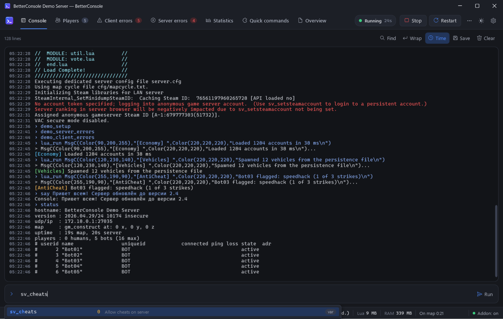

Suggestions come from the server itself: every command and variable registered by the engine, the
gamemode, Lua and binary modules — with the **current value** of variables (refreshed while the list
is open) and their help text. Names that start with what you typed come first, then names that
contain it. After `map ` or `changelevel ` the maps of the server are suggested.

Commands with characters srcds cannot type (Cyrillic, emoji …) and very long commands are sent
through the companion addon and run by the engine directly, so `say Всем привет` just works. Commands
that GMod's Lua refuses to run (`game.ConsoleCommand blocked!`) are not affected: what you type runs
as if you typed it into the srcds window.

## Players

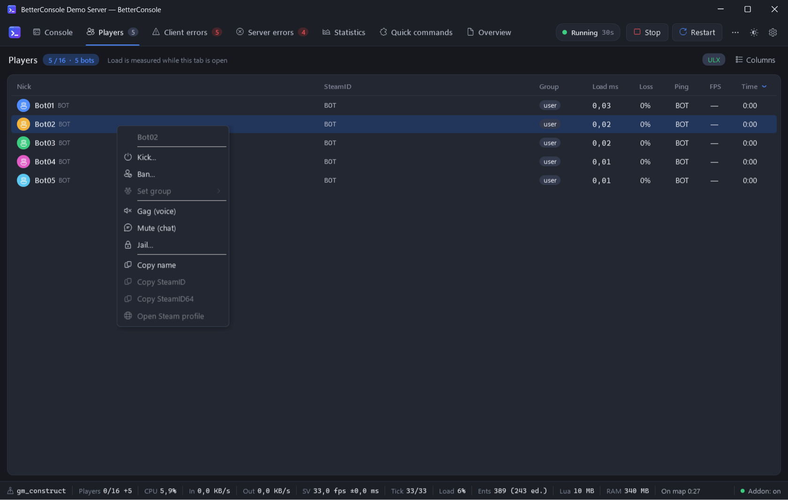

Everyone on the server, updated every second while the tab is open.

- **Sort** by any column (click the header; again to reverse). Default: time on the server, the
  longest first, so new players are at the bottom. **Group** sorts by the group hierarchy, the
  highest first: superadmin, admin, operator, user — and your own groups where they inherit (from ULX,
  or from CAMI with other admin mods). The column you sorted by is remembered.
- **Columns**: right-click the header or press *Columns* to show or hide them. Available: Nick,
  SteamID, Group, Load ms, Loss, Ping, FPS, Time, IP, In, Out, Choke, Team, Score, cl_updaterate and
  cl_cmdrate. The last two start hidden: they are what the player's game asks for, and the server
  keeps them within `sv_minupdaterate` … `sv_maxupdaterate` and `sv_mincmdrate` … `sv_maxcmdrate`.
  Drag a header to move a column, its edge to resize it; BetterConsole keeps visibility, width and
  order (saved when it closes). *Reset columns* in the header menu brings back the default.
- **Steam avatars** next to the names (also in the client errors and in the admin dialogs). They come
  from the players' public Steam profiles and are cached for a few days; bots, players whose avatar
  could not be loaded, and *Settings → Players → Show Steam avatars* off show the coloured initial.
- **Load ms** is the server CPU time spent on that player per tick: processing their movement
  commands (every `StartCommand` … `FinishMove` hook) and the Lua handlers of the net messages they
  send. It is measured only while this tab is open. Yellow above 2.5 % of the tick, red above 6 %.
- **FPS** is the frame rate the player's game reports to the server.
- Icons after the name: gagged (voice), muted (chat), jailed.
- **Several players** at once: Ctrl+click, Shift+click, Ctrl+A or *Select all*, then right-click one
  of the selected rows. Every action applies to all of them, with one dialog for all. When only some
  are gagged (muted, jailed), the menu offers both, each for its part ("Gag (voice) · 2 of 3").
  Copied names and SteamIDs of several players go on one line, separated by spaces.

**Right-click a player** (or the selection) for:

| Action | With ULX | Without ULX |
|---|---|---|
| Kick… (reason) | `ulx kick` | `kickid` |
| Ban… (duration, reason) | `ulx banid` | `banid` + `writeid` (not bots) |
| Set group | `ulx adduserid` / `removeuserid` (saved) | `SetUserGroup` until they leave |
| Gag / Mute / Jail… / Unjail | `ulx gag`, `mute`, `jail` | — |
| Copy name / SteamID / SteamID64, open Steam profile | | |

Players are addressed by an id ULX resolves to exactly that player, so two players with the same
name, or names with spaces or Cyrillic, are not a problem.

Server addons and plugins can add their own items to this menu (freeze, heal, a command of your admin
mod…), and addons can hide built-in ones — a server with another ban system, say, can replace *Ban…*.
An item that only fits some of the selected players says so ("Unfreeze · 1 of 3") and runs for those.
How: [lua-api.md](lua-api.md#player-menu), [plugins.md](plugins.md).

## Client errors

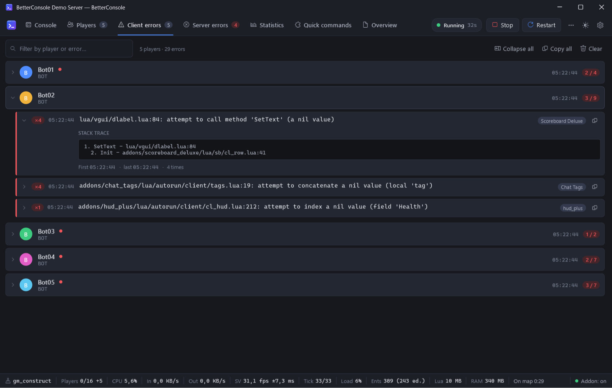

Lua errors that happen in players' games (GMod sends them to the server). One row per player, sorted
by name, all collapsed at first; a red dot marks players with errors you have not opened yet.

- Open a player to see their errors, **the most recent first**. The same error happening again only
  raises its counter (×12) and its time.
- The arrow of an error shows its stack trace. Its text can be selected with the mouse and copied
  (clicks into the text do not fold the card), or use the copy button. Lua paths open in the editor
  with a double click (see [Opening Lua files](#opening-lua-files)).
- **Nothing jumps**: while the mouse pointer is over the list, errors that happen again only update
  their counters — the cards move to the top only after you leave the list. New errors appear
  without moving what you are looking at, and a newly erroring player does not close the one you
  have open.

## Server errors

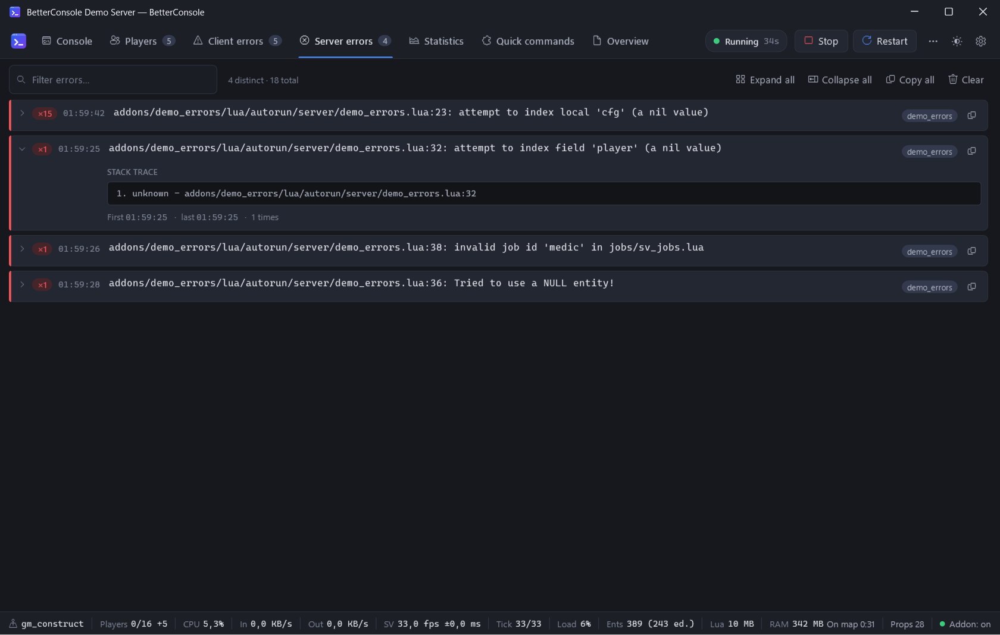

Errors of the server's own Lua, **oldest first**, newest at the bottom (the list follows new errors
while you are at the bottom). Repeats raise the counter of the existing card instead of adding a new
one. The arrow shows the stack trace, the *Timer Failed!* line of timers, the addon and its Workshop
id; double-click a path to open the file.

*Settings → Count errors that differ only in entity numbers or table addresses as one* merges
`Entity [123][prop_physics]` and `Entity [456][prop_physics]` into one error (default).

Both error tabs have a filter box, *Copy all* and *Clear*.

## Statistics

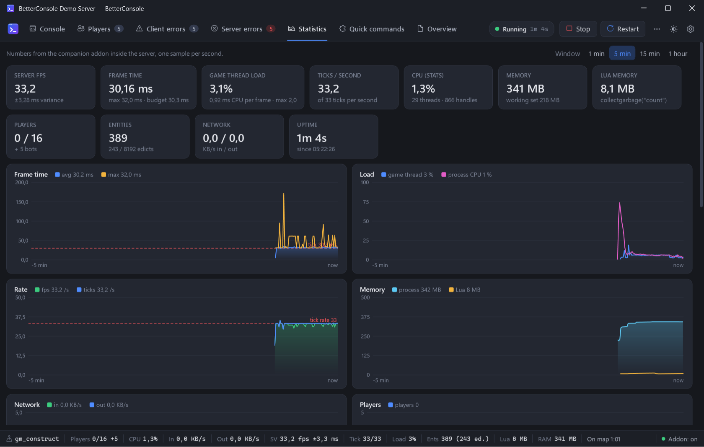

| Number | Meaning |
|---|---|
| **Server FPS** | frames the server ran per second, and the deviation of the frame time — what `net_graph` shows as `sv` |
| **Frame time** | average and longest time between frames; should stay at the tick interval (the red dashed line) |
| **Game thread load** | how much of the time the main thread was busy, measured with its CPU time. Close to 100 % the server can no longer keep its tick rate |
| **Ticks / second** | ticks actually run per second, against the tick rate |
| **CPU (stats)** | CPU time of srcds over 5 seconds, computed like the engine's `stats` command (100 % = one core) |
| **Memory** | private memory of srcds and its working set |
| **Lua memory** | `collectgarbage("count")` |
| **Entities** | entity count and edicts out of 8192 (the server crashes when edicts run out) |
| **Network** | data from / to all clients |

Charts show 1 minute to 1 hour (buttons on the top right); hover them for exact values.

Server addons and plugins can add numbers, charts and sections of their own here (money in the economy,
a job queue…) and hide built-in parts they make redundant: [lua-api.md](lua-api.md#the-statistics-tab).

### Lag spikes

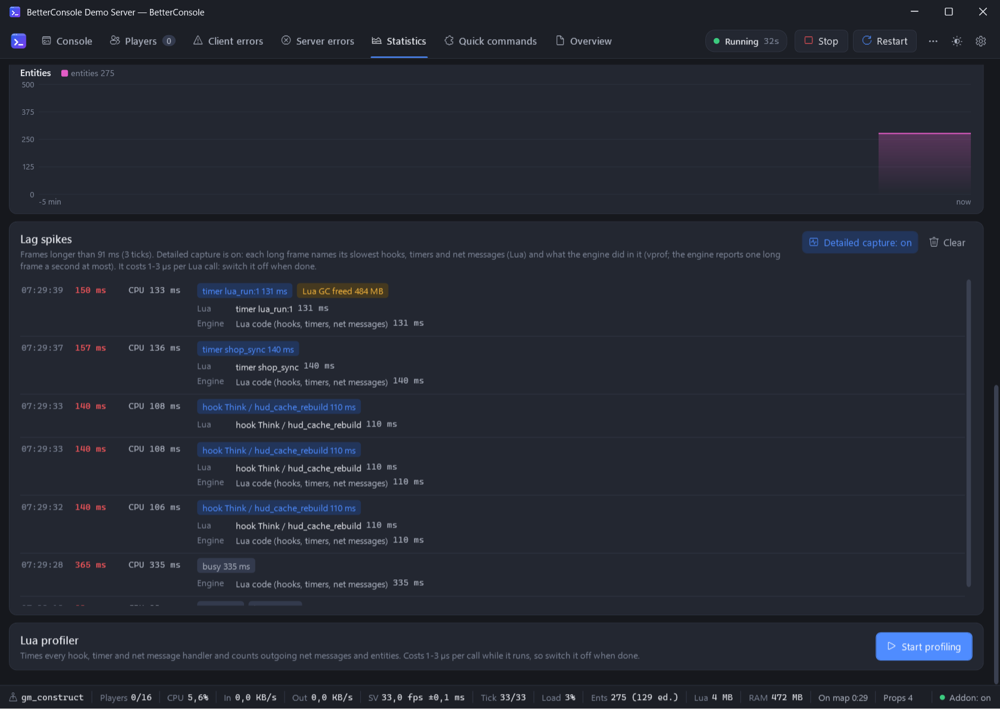

Every frame longer than three ticks and 50 ms (a hitch players notice), newest first, with its length, the CPU
time of the game thread in it, and what it was made of:

- **no CPU for X ms**: the thread was waiting for most of the frame — for the disk (a model, a sound
  or a map file read the first time), for the srcds console window (text selected in it stops the
  server), or for other programs.
- **timer …**: the slowest timer of the frame (always measured; it costs next to nothing).
- **Lua GC freed X MB**: the Lua garbage collector ran in the frame.
- **physics X ms**, **±N entities** (a dupe pasted, a cleanup), **joined: names**, **map start**.

**Detailed capture** (the button on the card) times every hook, timer and net message of each frame
and turns on the engine's own profiler (vprof). Each long frame then gets a *Lua* line with its
slowest callbacks (net messages with their size and sender) and an *Engine* line with where the
engine's time went: Lua code, physics, entity Think, snapshots to the players, network … The engine
reports one long frame a second at most, so not every row gets an *Engine* line. Its reports are kept
out of the console, and the files it writes for them (`garrysmod/vprof/vprofN.txt`) are deleted. The
capture costs 1–3 microseconds per Lua call: switch it off when you are done. Double-click a Lua name
to open its file.

### Lua profiler

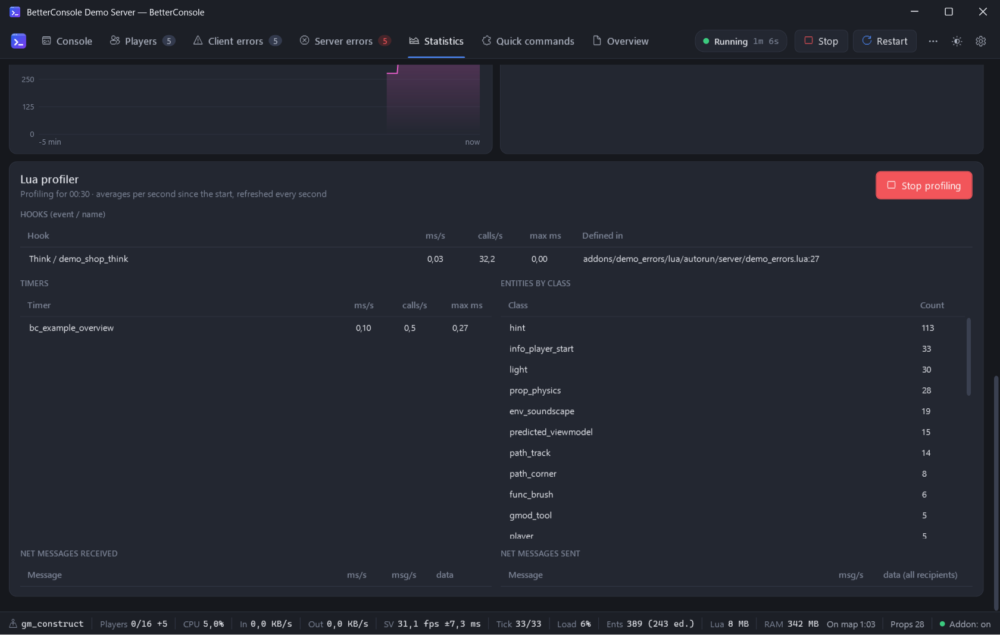

Press **Start profiling** to time every hook, timer and net message handler, and to count outgoing
net messages and entities per class. Numbers are averages per second since you started; rows are
updated in place and stay in the table, so the list does not jump. The biggest entries come first
(click a column to sort by it); the order holds still while the pointer is over a table. After
**Stop profiling** the last results stay until the next start. Profiling costs 1–3 microseconds per
call, so stop it when you are done (it also stops when BetterConsole disconnects).

Hover the name of a hook, timer or net message for where its function is defined; double-click it (or
the *Defined in* path) to open that file at that line.

It works next to other profilers (gProfiler and the like): BetterConsole does not wrap a hook twice
when another profiler has wrapped its wrapper, and names timers after the function inside such
wrappers.

## Opening Lua files

Paths of Lua files in errors (the message, the stack trace, *Timer Failed!*) and in the profiler
(hooks, timers, net messages) open in your editor at their line with a **double click**. They look
like the rest of the text; the pointer turns into a hand over the paths whose file BetterConsole found
on the server — `addons/<folder>/lua/…`, `lua/…` (in `garrysmod/lua` or in a folder addon),
`gamemodes/…`, and paths Lua shortened to `...nested/file.lua`. Files packed in workshop `.gma` files
are not on disk and cannot be opened. Client errors open the server's copy of the file.

*Settings → Lua errors and files → Open Lua files with*: automatic (the first of Visual Studio Code,
Cursor, VSCodium, Notepad++, Sublime Text, else Notepad), one of them, the program Windows opens
`.lua` files with, or a command of your own with `{file}` and `{line}`, for example
`"C:\Tools\editor.exe" --line {line} "{file}"`.

## Several servers (multi-console)

*Settings → Servers → Multi-console* runs several servers from one BetterConsole. Add them in the list
below (a new one gets the folder of the selected one and a free `-port`), give them names, and set
the options of each: folder, start options, Always run, CPU, scheduled restarts. Everything else
(theme, console, editor, plugins …) is shared.

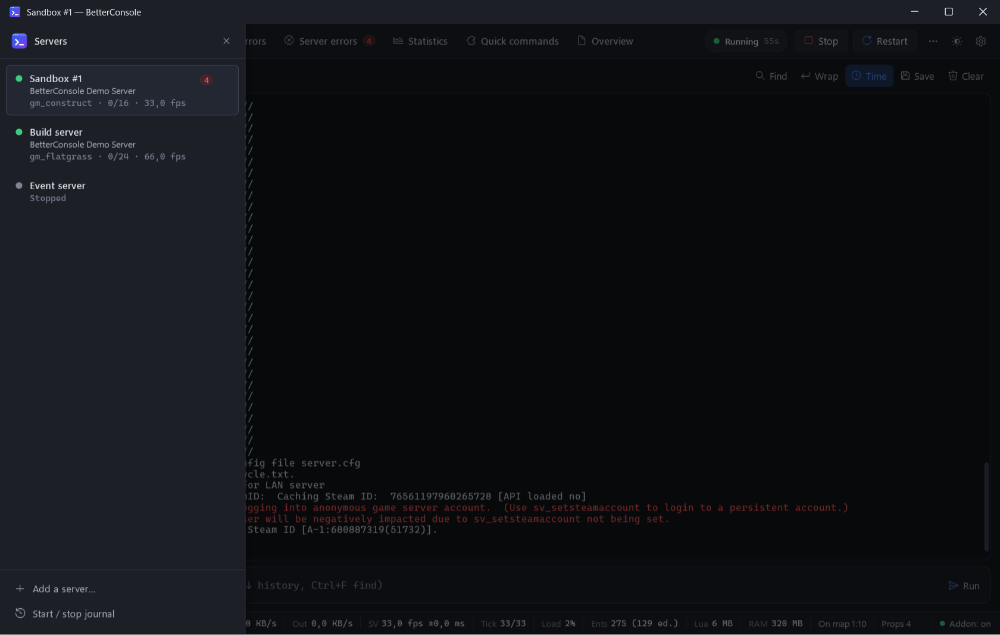

- The **logo** in the top left corner opens the server list; it slides in over the window. Each
  server shows its state, name, hostname, map, players and server fps, and how many new server errors
  it has. Click one to show it; Esc or a click next to the list closes it. **Ctrl+Alt+1…9** switch
  servers directly. A red dot on the logo: another server crashed or has errors you have not seen.
- The `⋯` button of a server (or a right-click): start, stop, restart, its own window, CPU affinity,
  its settings.
- **Its own window**: a server can be taken out of the main window (*Open in a window of its own*, or
  the `…` menu of the window) to watch several at once. Closing that window puts the server back into
  the main window — it keeps running. *Bring all servers into this window* in the list closes them
  all. Own windows open again where they were the next time. One server always stays in the main
  window; closing the main window closes BetterConsole and stops all servers.
- Every server has its own console, errors, players, statistics, addon tabs and plugin instances.

## Keeping a server up

- **Restart the server when it crashes or quits by itself** — after the delay you set. More than five
  crashes in ten minutes pause it (a crash loop).
- **Always run** — the server is started again whatever stopped it: a crash, a quit from the game,
  rcon or an addon, `quit` typed in the console. It keeps trying after many crashes, waiting longer
  each time (up to 5 minutes), and it starts with BetterConsole. Only **Stop**, **Kill** and closing
  BetterConsole leave it off.
- **Scheduled restarts** — every day at the times you enter (`05:00, 17:30`). Players are warned in the
  chat the given minutes before (`5, 1`) with your text (`{time}` becomes "5 minutes"). A restart that
  is more than two minutes late (the PC was asleep) is skipped. The next one is in the tooltip of the
  state.

### The start / stop journal

`…` → **Start / stop journal**: when each server started, stopped, crashed or quit by itself, with the
reason — *Start button*, *Restart (Ctrl+F5)*, *Scheduled restart (05:00)*, *Always run after the
crash*, *"quit" typed in the console*, *rcon from 1.2.3.4*, *Crash: exit code 0xC0000005 (access
violation)*, *BetterConsole was closed* … — and how long it had been up. Filter by server, copy, or
open the file (`journal.jsonl` in the data folder; the newest 5000 entries are kept).

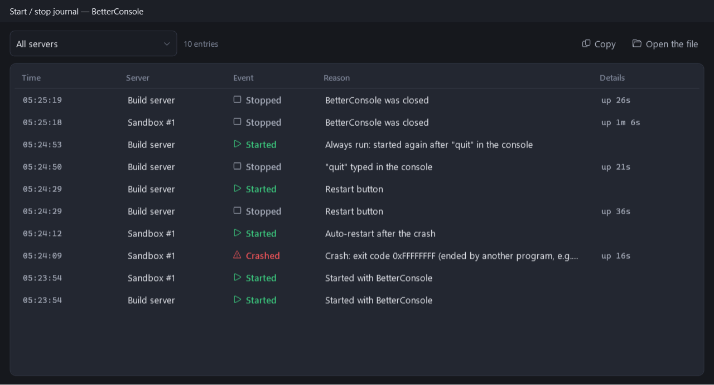

GMod refuses `quit` from Lua (`game.ConsoleCommand blocked! (quit)`), so ULX's `ulx rcon quit` does
not stop a server; rcon from outside and binary modules can.

## CPU affinity and priority

`…` → **CPU affinity and priority** (or *Settings → Server → Processors and priority*): tick the
logical processors srcds may run on, grouped by core, and pick a priority (Idle … High). All
processors and Normal are the default. Changes apply to the running server at once and on every
start. With several servers, the processors other servers are pinned to are named under each box:
give every busy server a core of its own.

The dialog names the processor and shows what Windows knows about its cores:

- **Hybrid CPUs** (Intel since the 12th generation, some AMD laptop chips): performance cores (P) and
  efficiency cores (E, and LP-E on chips that have them) in groups of their own, with *P-cores* /
  *E-cores* buttons. Put game servers on P-cores: an E-core is much slower for srcds' single game thread.
- **Several L3 caches** (Ryzen with two CCDs, such as a 7950X3D): the cores in groups by the cache they
  share, with its size. Keep a server within one group; on X3D chips the group with the 3D V-Cache is
  usually the faster one for a game server.
- **A virtual machine** (a VPS; known by the hypervisor or the firmware: KVM, Hyper-V, VMware …): no
  groups, only a note. The processors are virtual: the host runs them on whichever real cores it likes,
  so P/E cores and caches can't be seen from inside, and a shared vCPU can stall while the host serves
  other machines (it appears among the lag spikes as *no CPU*). Pinning still keeps several servers in
  the VM apart. Windows with virtualization-based security on real hardware is not taken for a VM.

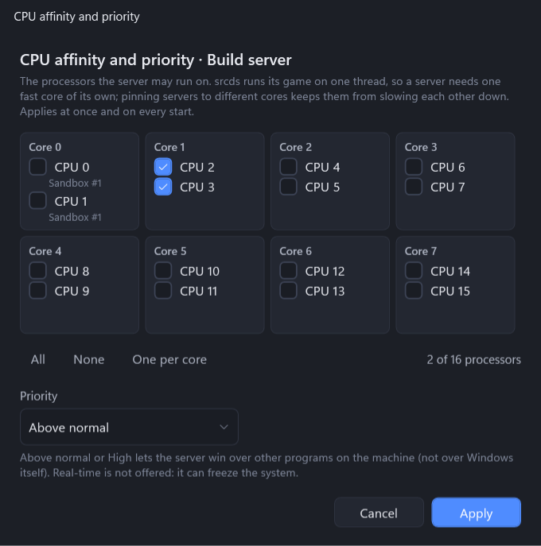

## Status bar

`map · Players 12/20 +2 · CPU 18.4% · In 34.2 KB/s · Out 120.5 KB/s · SV 33.0 fps ±0.4 ms · Tick 33/33 · Load 22% · Ents 2310 (812 ed.) · Lua 48 MB · RAM 1240 MB`

Hover an item for its explanation. *SV hibernating* means the server ran no frames for a few
seconds — it is hibernating (no players, `sv_hibernate_think 0`) or frozen. Addons and plugins can
add their own items after the built-in ones. In a narrow window the items that do not fit are left
out, from the end.

**Right-click the status bar** to choose what it shows: every built-in item and every item of an
addon or a plugin can be hidden; *Show all* brings them back. The choice is the same in every window
and is saved when BetterConsole closes.

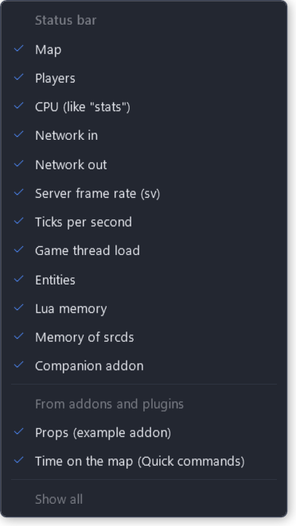

## Themes

The sun icon switches between Dark, Light, Midnight and Graphite, plus the themes in the `themes`
folder (two come with the release). How to make one: [themes.md](themes.md).

## Compact mode

*… → Compact mode* (also in the theme menu and in *Settings → Appearance*). The window gets smaller
controls, square corners and one plain palette (dark, or light when Windows' apps are light) instead
of the themes; shadows, animations and Steam avatars are off, and charts are drawn without smoothing.
That is the least work for the processor and the graphics card — on a VPS without a graphics card
Windows draws everything in software, so it helps most there. Only the look changes: every feature
works as before. The theme button is hidden while it is on.

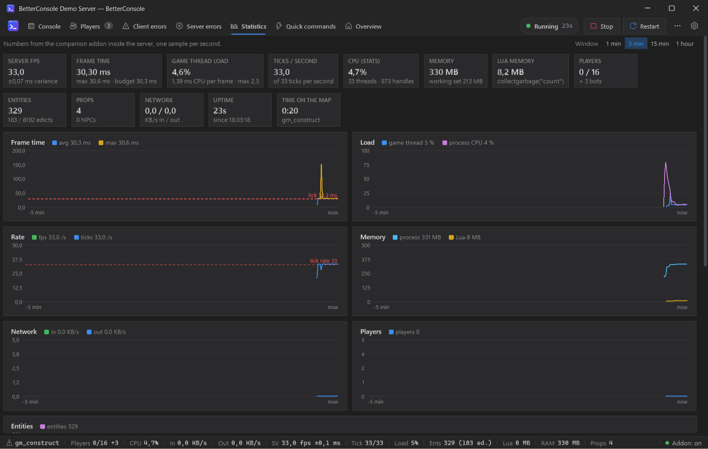

## Keyboard shortcuts

| Key | |
|---|---|
| F5 / Shift+F5 / Ctrl+F5 | start / stop / restart the server |
| Ctrl+1 … Ctrl+9 | switch tabs |
| Ctrl+Tab | next tab |
| Ctrl+F | find in the console |
| Ctrl+Alt+1 … Ctrl+Alt+9 | show another server (multi-console) |
| Esc | close the server list |
